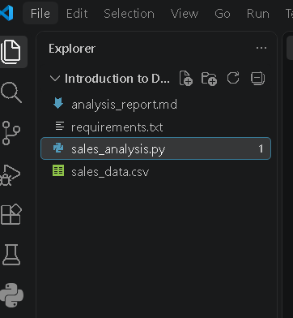
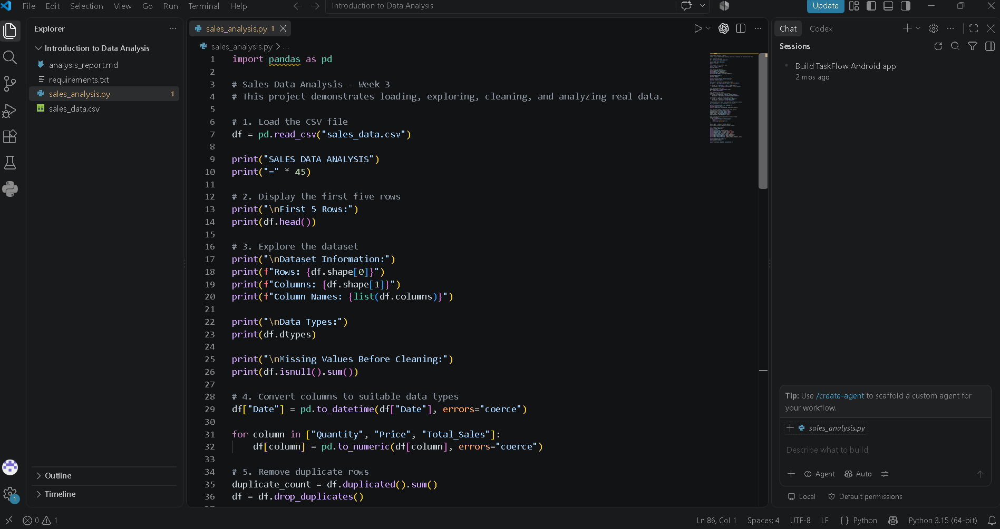
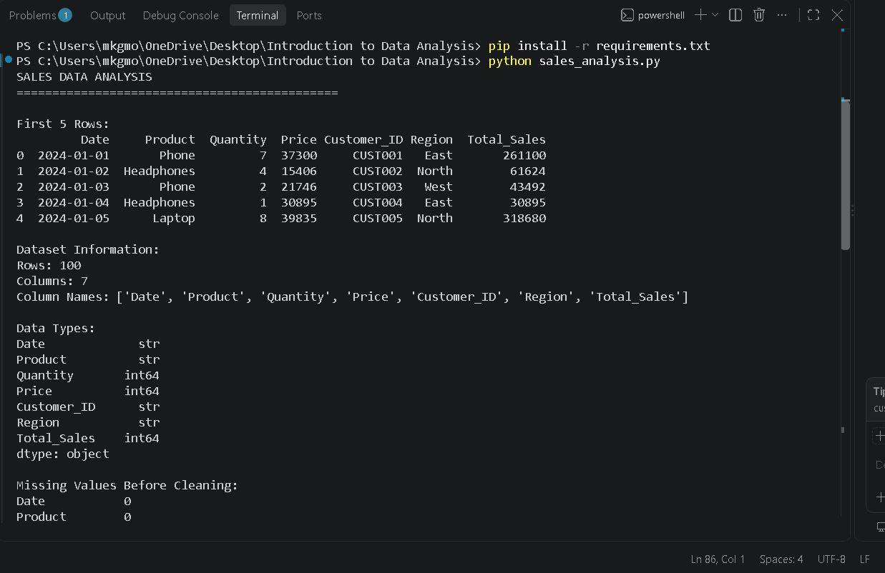
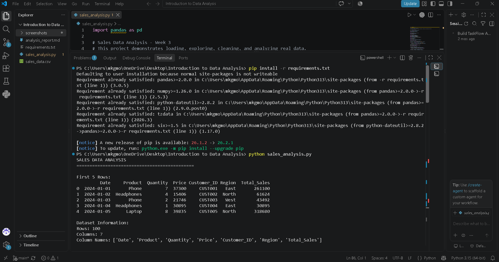

# Week 3 — Sales Data Analysis Report

## 1. Project Overview

This beginner-level project demonstrates the basic data analysis workflow using Python and Pandas. A sales CSV dataset is loaded, explored, cleaned, and analyzed to find useful sales insights.

## 2. Project Objectives

- Understand the basic purpose of data analysis.
- Use Pandas for Excel-like data operations.
- Read data from a CSV file.
- Explore rows, columns, and data types.
- Check and handle missing values.
- Remove duplicate records.
- Calculate average, maximum, and minimum sales.
- Find total sales and the best-selling product.
- Present the findings in a clean report.

## 3. Dataset

**File:** `sales_data.csv`

The provided dataset contains **100 rows and 7 columns**:

- Date
- Product
- Quantity
- Price
- Customer_ID
- Region
- Total_Sales

> Note: The internship instructions mention 100 rows and 5 columns, but the supplied CSV actually contains 100 rows and 7 columns. The project uses the supplied dataset without removing valid columns.

## 4. Project Structure

```text
sales-analysis/
├── sales_analysis.py
├── sales_data.csv
├── analysis_report.md
└── requirements.txt
```

## 5. Setup Instructions

Open the project folder in VS Code and run:

```bash
pip install -r requirements.txt
```

Then run:

```bash
python sales_analysis.py
```

## 6. Data Exploration

The program:
- Displays the first five rows using `df.head()`.
- Checks the number of rows and columns using `df.shape`.
- Displays column names using `df.columns`.
- Checks data types using `df.dtypes`.
- Checks missing values using `df.isnull().sum()`.

## 7. Data Cleaning

The program:
1. Converts `Date` to a date format.
2. Converts numerical columns to numeric values.
3. Checks for duplicate rows.
4. Removes duplicate rows.
5. Fills missing numerical values with the median.
6. Fills missing text values with `Unknown`.
7. Recalculates `Total_Sales` using `Quantity × Price`.

**Missing values in the supplied dataset before cleaning:** None.

**Duplicate rows in the supplied dataset:** 0.

Therefore, the supplied dataset did not require actual missing-value or duplicate removal, but the code includes the required handling so it can also work with imperfect data.

## 8. Analysis Results

| Metric | Result |
|---|---:|
| Total Sales / Revenue | ₹12,365,048.00 |
| Average Sale | ₹123,650.48 |
| Highest Sale | ₹373,932.00 |
| Lowest Sale | ₹6,540.00 |
| Total Quantity Sold | 478 |
| Best-Selling Product | Laptop |
| Best Product Revenue | ₹3,889,210.00 |

### Revenue by Product

| Product | Revenue |
|---|---:|
| Laptop | ₹3,889,210.00 |
| Tablet | ₹2,884,340.00 |
| Phone | ₹2,859,394.00 |
| Headphones | ₹1,384,033.00 |
| Monitor | ₹1,348,071.00 |

## 9. Key Findings

1. Total sales revenue is **₹12,365,048.00**.
2. The average sale is **₹123,650.48**.
3. The highest individual sale is **₹373,932.00**.
4. The lowest individual sale is **₹6,540.00**.
5. A total of **478 units** were sold.
6. **Laptop** is the best-selling product by total revenue.
7. Laptop generated **₹3,889,210.00** in revenue.

## 10. Technical Details

### Main Library
`pandas` is used because it provides simple operations for reading, cleaning, grouping, and calculating statistics from tabular data.

### Main Operations

- `pd.read_csv()` — reads the CSV file.
- `head()` — displays the first rows.
- `shape` — returns row and column count.
- `dtypes` — checks data types.
- `isnull().sum()` — checks missing values.
- `drop_duplicates()` — removes duplicate records.
- `fillna()` — handles missing values.
- `sum()` — calculates total values.
- `mean()` — calculates average values.
- `max()` — finds the highest value.
- `min()` — finds the lowest value.
- `groupby()` — calculates revenue for each product.

### Analysis Flow

```text
CSV File
   ↓
Load with Pandas
   ↓
Explore Data
   ↓
Check Missing Values
   ↓
Clean Data
   ↓
Calculate Statistics
   ↓
Group Sales by Product
   ↓
Find Best Product
   ↓
Display Findings
```

## 11. Testing Evidence

### Test 1 — Dataset Loading
Command:

```bash
python sales_analysis.py
```

Expected result: The first five rows and dataset information are displayed.

### Test 2 — Data Cleaning
Expected result: Missing-value counts are displayed before and after cleaning, and duplicate count is reported.

### Test 3 — Sales Metrics
Expected result: Total sales, average, highest, and lowest sales are displayed.

### Test 4 — Best Product
Expected result: The program identifies **Laptop** as the best-selling product.

### Test Result

**PASS — Program executed successfully without an execution error.**

## 12. Visual Documentation

### Screenshot 1 — Project Structure

The screenshot below shows the project structure in VS Code, including the required project files.



### Screenshot 2 — Python Code

The screenshot below shows the main Python and Pandas code used for the sales data analysis.



### Screenshot 3 — Program Output

The screenshot below shows the successful execution of the Python program and the final sales analysis results.



### Screenshot 4 — Pandas Installation

The screenshot below shows the successful installation of the required Pandas dependency using the requirements file.


## 13. Conclusion

This project successfully demonstrates the beginner-level data analysis process using Python and Pandas. The dataset was loaded from CSV, explored, checked for missing values and duplicates, cleaned, and analyzed.

The analysis found that **Laptop** generated the highest total revenue among the products.

## 14. Requirements Checklist

- [x] Pandas used to load and analyze data
- [x] Missing values checked and handled in code
- [x] Duplicate values checked and removed in code
- [x] At least 3 metrics calculated
- [x] Clean formatted report created
- [x] Comments added to explain code
- [x] Project overview included
- [x] Setup instructions included
- [x] Code structure included
- [x] Visual documentation instructions included
- [x] Technical details included
- [x] Testing evidence included
